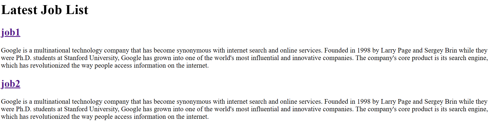
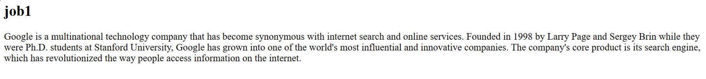

## Learned Command

Create Database Migrations<br>
`sail php artisan make:migration <table name>`
`sail php artisan make:migration create_job_list_table`
Migration
`sail php artisan migrate`
Refresh Migration
`sail php artisan migrate:refresh`
Seed
`sail php artisan db:seed`
Refresh and Seed 
`sail php artisan migrate:refresh --seed`
Add a new Model
`sail php artisan make:model <model name>`
## Commit History
1. Route Basic

Clicking job1


2. Database Migration & Model Creation & Factory

    > Problem: 
    >> It seems that laravel will execute SELECT * FROM "modulename"+"s" ,
    >>,SELECT * FROM jobs in this case, when use the system provided all() function extended from Module.

    > Solution:
    >> In database, create a table named "modulename"+"s"(jobs).

3. Layout-1
    > Learned
    > - asset helper: asset()  
    >   - ```<link rel="icon" href="asset('images/favicon.ico')" />```
    > - `@extend`
    > - `@section`
    > - `@endsection`
4. Layout-2
    > Learned
    > - `@include`
    > Review
    > - We can create module and store module's data in database using migrate. Also, we can use route to pass moudule's instance to layout.
5. 
    - <a herf = "https://laravel.com/docs/10.x/routing#implicit-binding">Implicit Binding</a>
         ```
        Route::get('/jobList/{job}',function(Job $job){
            return view('job',[
                'job' => $job
            ]);
        });
        ```
    - <a herf = "https://laravel.com/docs/10.x/blade#components">blade component</a>

    https://www.youtube.com/watch?v=MYyJ4PuL4pY&t=2826s
    next start from 1:34:55

Remember to update 
```protected $fillable = ['title', 'company', 'location', 'website', 'email', 'description', 'tags', 'logo'];```
when yout want to add new column to database

